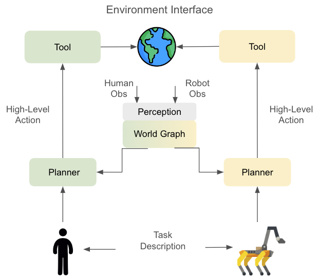
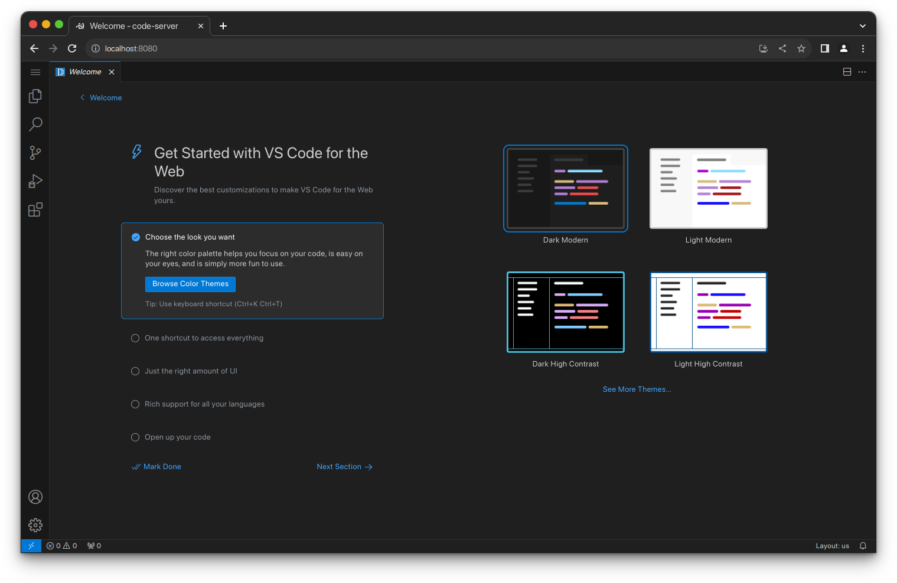

<figure>
    <p align="center">
    
    </p>
</figure>

# Evaluation of Habitat Robotics using Large Language Models

<div align="center">
  <a href="https://arxiv.org/abs/2507.06157v1">   </a>
  <a href="https://destin-v.github.io/benchmark-robotics-llm-paper/">   </a>
</div>

<p align="center">
  <a href="https://devguide.python.org/versions/">                  </a>
  <a href="https://github.com/pre-commit/pre-commit">               </a>
  <a href="https://docs.pytest.org/en/7.1.x/getting-started.html">  </a>
  <a href="https://black.readthedocs.io/en/stable/index.html">      </a>
</p>

# 🤔 Description
This is a fork of the PARTNR benchmark.  The original PARTNR benchmark was designed to run with Llama. This repo adds a script called `run_experiments.py` which allows users to benchmark agents from API providers that follow the OpenAI interface.

# 🗺️ Information Flow
Below is a figure showing the flow of information through decentralized planners in PARTNR. Please note that there is no explicit communication between the two decentralized planners. The [Environment Interface](./habitat_llm/agent/env/environment_interface.py) reads observations for each agent and sends them to the [Perception Module](./habitat_llm/perception/perception_sim.py). The processed observations are used to update the [World Graph](./habitat_llm/world_model/world_graph.py) and the [Planner](./habitat_llm/planner/planner.py) (based on an LLM or other system) uses the world graph and the task description to select a [Tool](./habitat_llm/tools/tool.py) to interact with the environment.

<p align="center">
  
</p>

---
<center>
The code is designed to test the following four cases:

|               |                   | Observability |   | 
|---            |---                |---            |---|
|               |                   | Full          | Partial   | 
|**Planner**    | Centralized       | x             | x         |  
|               | Decentralized     | x             | x         |
</center>

# 🛠️ Requirements
A GPU is required.  Tested on RTX 4090.  

If you are low of RAM or VRAM, you will likely get an Out of Memory (OOM) error.

# 🏎️ Quickstart
Everything is provided for you in a container.


Run container:
---
1. Setup your OpenAI API keys prior to starting. (OPTIONAL)
    ```bash
    export OPENAI_API_KEY="..."
    ```

2. Create a directory to save your experiments.
    ```bash
    mkdir outputs
    ```

3. Start container. The container is over **50GB**!
    ```bash
    podman run --rm \
    --env OPENAI_API_KEY \
    --volume $PWD/outputs:/root/benchmark-robotics-llm/outputs \
    --device nvidia.com/gpu=all \
    --publish 8080:8080 \
    ghcr.io/destin-v/benchmark-robotics-llm
    ```

    > [!IMPORTANT]  
    > Use `--entrypoint /bin/bash` argument for standard bash.

4. Enter address in browser.
    ```bash
    localhost:8080
    ```
    


Inside container:
---
1. In VsCode type `CONTROL-J` to open a terminal and navigate to the repo.
    ```bash
    micromamba activate myenv 
    python run_experiments.py
    ```

2. Outputs will be saved to the `outputs` folder on your host machine.  To view results run: 
    ```bash
    python scripts/read_results.py <output_dir>/<dataset_name>
    ```

They will be labeled with `full`/`partial` observability and `centralized`/`decentralized` planning.

# 🥘 Custom Models
You can easily edit the `run_experiments.py` file to test a different model:

```python
 if __name__ == "__main__":
     """This needs to be run in a terminal."""
 
     # Start timer.
     timeout: int = 360 # modify this to extend the test time
     start_time: float = time.time()
     final_time: float = time.time()
 
     processes: list[Popen] = []
 
     # Non-reasoning models
     processes.extend(test_runner("gpt-4o")) # set your desired models
     processes.extend(test_runner("gpt-4.1")) # set your desired models
 
     # Reasoning models
     processes.extend(test_runner("o1")) # set your desired models
     processes.extend(test_runner("o3")) # set your desired models
     processes.extend(test_runner("o3-mini")) # set your desired models
 
     # Wait until timeout.
     while abs(final_time - start_time) < timeout:
         final_time: float = time.time()
         time.sleep(1)
 
     # Kill all processes.
     for process in processes:
         process.kill()
     print("Timeout Reached!")
     
```

# 🦙 Ollama Server
Use Ollama to host local models. Steps:

1. Download [Ollama](https://ollama.com/download).
    ```bash
    curl -fsSL https://ollama.com/install.sh | sh
    ```
2. Start Ollama.
    ```bash
    ollama serve
    ```
3. Download a model from the [library](https://ollama.com/library).
    ```bash
    ollama pull gpt-oss:20b
    ```
4. Modify script to use Ollama (instructions below).
    ```bash
    vim +65 habitat_llm/llm/openai_chat.py
    ```

    ```python
    self.client = OpenAI(
        base_url="http://localhost:11434/v1",  # Local Ollama API
        api_key="ollama"                       # Dummy key
    )  
    ```

# 🐛 Troubleshooting

### Enter Container
---
```bash
podman run -it --rm \
--env OPENAI_API_KEY \
-v $PWD/outputs:/root/benchmark-robotics-llm/outputs \
--device nvidia.com/gpu=all \
--entrypoint /bin/bash \
ghcr.io/destin-v/benchmark-robotics-llm
```


### Proxy Error
---
If you get an error stating that `proxies` does not exist, this is a bug in the OpenAI package.  Fix it by performing the following:

1. Open file and go to line 777:
    ```bash
    vim +777 /root/micromamba/envs/myenv/lib/python3.9/site-packages/openai/_base_client.py
    ```
2. Replace: `proxies` with `proxy`

3. Save the edited file and now run: `python run_experiments.py`.

### Out of Memory Error
---
To reduce memory usage you can turn off the `save_video` flag from within the container:

```bash
vim +51 /root/benchmark-robotics-llm/habitat_llm/conf/examples/planner_multi_agent_demo_config.yaml
```

```yaml
save_video: False
```

# 👷🏻 Installation
For manual installation **(not recommended)**, refer to [INSTALLATION.md](INSTALLATION.md)

# 📑 Citation
If you use our codebase or dataset in your research, please cite the [PARTNR](https://arxiv.org/pdf/2411.00081) paper and us:

```
@inproceedings{Habitat-LLM-Benchmarks,
    author = {William Li and Lei Hamilton and Kaise Al-natour and Sanjeev Mohindra},
    title = {Evaluation of Habitat Robotics using Large Language Models},
    booktitle = {Institute of Electrical and Electronics Engineers (IEEE)},
    year = {2025}}
```
